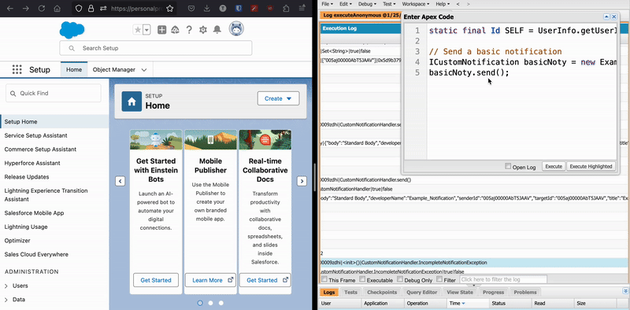

# salesforce-custom-notifications

A simple, testable, extendable notification builder for Custom Notifications in Salesforce via Apex.

Installation instructions:

1. Clone or download repository.
2. Copy force-app/main/default/classes directory and move to your project.

